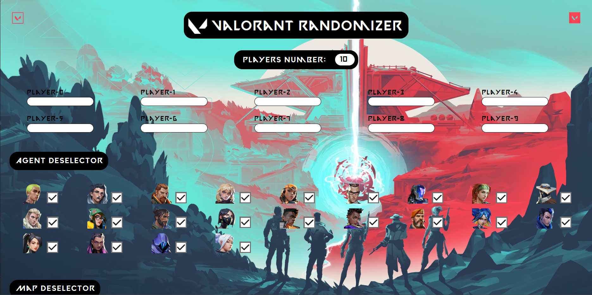
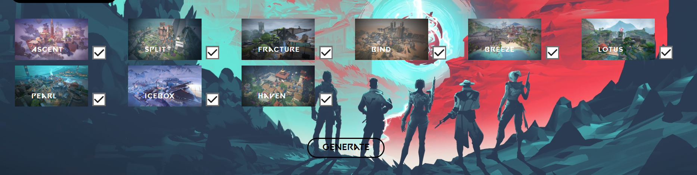
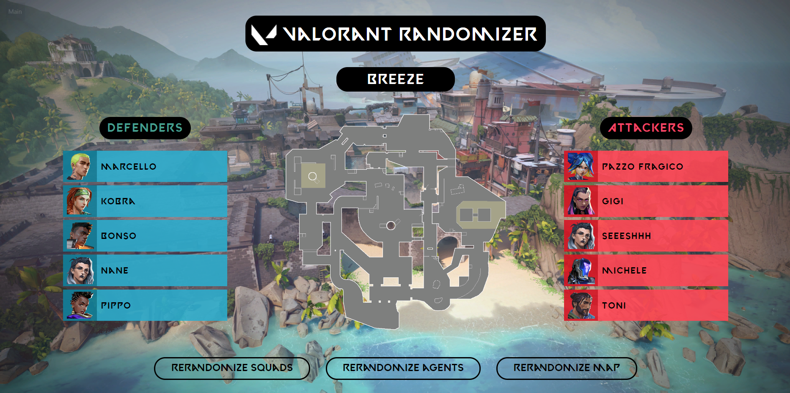
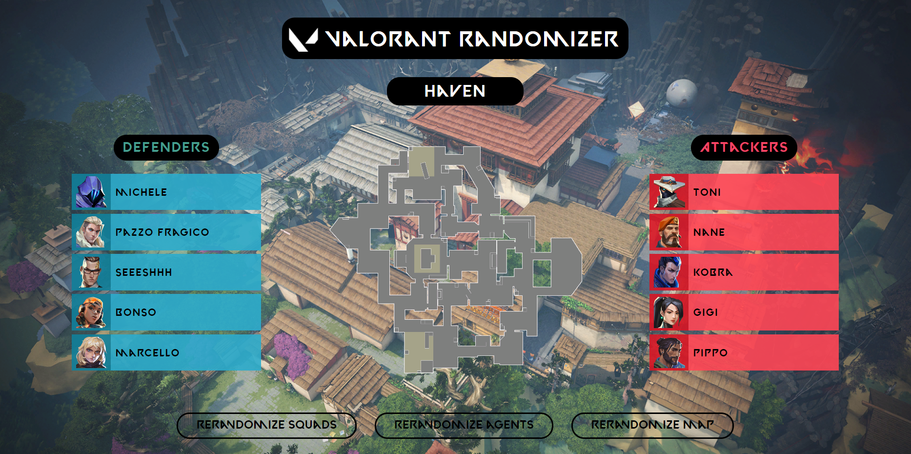
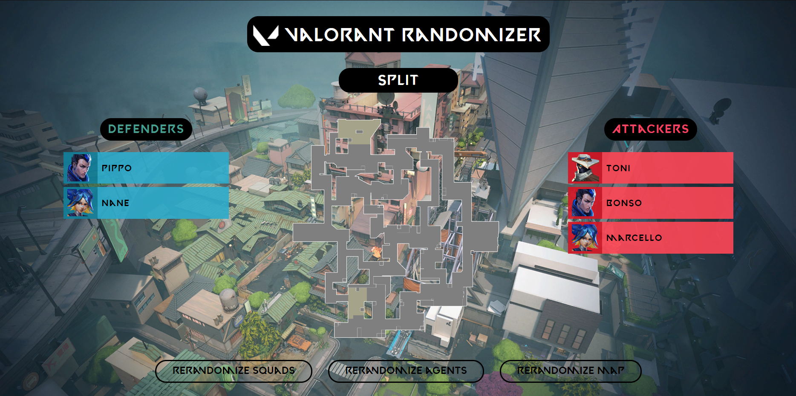
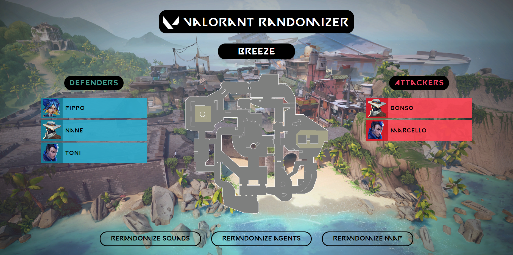

# Valorant_Randomizer
It's for educational purpose, I swear! (he lied).

Author: [ErosM04](https://github.com/ErosM04)

Old version contributors: [TmsRvl](https://github.com/TmsRvl) and [Fran4end](https://github.com/Fran4end)

## What is this?
To run open ``Randomize.html``.

This home-made project is a program that can be used to create on-time random squads for exciting [Valorant](https://playvalorant.com/it-it/) custom games. The data used by the program, such as agents and maps names and images, are always up to date as they are fetched from the non-official [valorant-api](https://valorant-api.com).

## Home page
The home page ``Randomize.html`` consist in a player number selector which is used to specify the amount of players (0 up to 10). For each player an input text form will appear, and the user can then inser the name of the player. Duplicate or empty names can't be inserted (**Generate** button won't work).

Then there is the agents and maps selection menus. To avoid using an agent or a map, just deselect it. Pay attention! because the amount of agents must be at least half of the length of the players number (e.g. players = 3, length required = 2 or players = 6, length required = 3), each name mustn't be longer then 18 characters and it has to be at least one map (or **Generate** button won't work).

Using the **Generate** button the data will be saved in the session and then the browser is redirected to the second page ``pages/play.html``.

    

    

## Second page
After loading the second page ``play.html``, all the data are randomized.

This page has a central subtitle with the name of the map, the backgroud image is the map image and the center image is the map layout.

Then there are to squads, **Defenders** (blue on the left) and **Attackers** (red on the right). Each squad will have the same amount of player (one more if the total is odd), and for each palyer there is a row with the image of the agent and the name of the player.

    

Finally in the bottom of the page there are 3 buttons, one to re-randomize the squads (and so the agents), one to re-randomize the agents and one to re-randomize the map.

    

Example when having an odd total amount of players:

    

Re-randomizing it the squads players number may also change:

    

